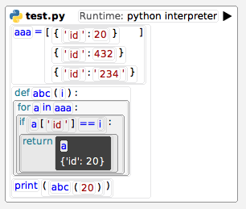

# Sandblocks/TreeSitter Runtimes

The runtimes system as part of Sandblocks-TreeSitter allows you to execute code from supported languages.
It comes with support for monitoring its stdout/stderr and injecting watches that report back to the Sandblocks IDE.

## Opening and Running a File

In a Sandblocks workspace, run:
```
(SBTSFile filepath: '/home/you/test.py') open
```

At the top of the file will be a Play button. Once clicked, it will try to find a python interpreter on your system and execute the given file.



## Watches

You can insert a watch on any block moment but most likely inserting it on anything but an expression will result in a syntax error upon serialization or execution.
Insert a watch by either right-clicking the expression and filtering for `wrapWithWatch` or by pressing the Cmd+Shift+W shortcut.

## Offscreen Watches

By placing watches offscreen, you can use them to report values from the runtime back to your TreeSitter replacement blocks.

For example, we could make all Javascript `console.log` calls log to the Squeak Transcript as well by creating a replacement for `console.log` and serializing the expression with the watch's source code wrapped around it (see also `SBConsoleLogReporter` class that comes with Sandblocks):

```smalltalk
SBConsoleLogReporter>>initialize
    
    super initialize.
    " create a new empty watch and connect its reportedValue signal to our
      newValue: method "
    watch := SBTSWatch newEmpty when: #reportedValue send: #newValue: to: self

SBConsoleLogReporter>>writeSourceOn: aStream

    " update the watch's expression to the expression our replacement is wrapping "
	watch expression: self expression.
	
	aStream nextPutAll: 'console.log('.
	watch writeSourceOn: aStream.
	aStream nextPutAll: ')'

SBConsoleLogReporter>>newValue: aString

    " apparently our watch triggered a reportedValue signal, so we're called "
    Transcript showln: aString
```

You can also use this with custom code to extract specific values from the runtime:
```smalltalk
SBRequestReplacement>>initialize

    watch := SBTSWatch newEmpty when: #reportedValue send: #newRequest: to: self

SBRequestReplacement>>writeSourceOn: aStream

    " we are inserting this object literal in the code that expects a `req` variable
      to be in the local scope and reporting the object back to squeak "
    watch expression: (SBJavascript parseElement:
        '{path: req.path, headers: req.headers.map(h => [h.key, h.value])}').

    " ...our other serialization code, then our watch at a place where it's
      syntactically valid "
    watch writeSourceOn: aStream.
    " ...more serialization code "

SBRequestReplacement>>newRequest: aString

   " we get the data as a string, which we can then decode "
   data := Json readFrom: aString.
   Transcript showln: data headers
```

## Pretty-Printing

Runtimes may support pretty printing code. If they do, whenever code is serialized to text (e.g., when copying or writing to a file), the `#prettySourceString` is called on the block, which passes the regular `#sourceString` of the block to the external pretty printer.

## Javascript Web Runtime
The Javascript web runtime is special in that it does not actually invoke any programs.
Instead, it will only spawn a server that listens for watches to trigger.
